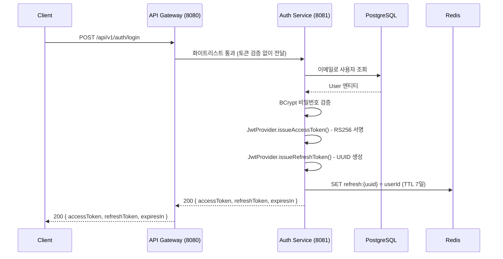
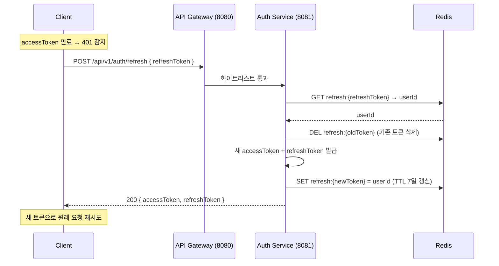
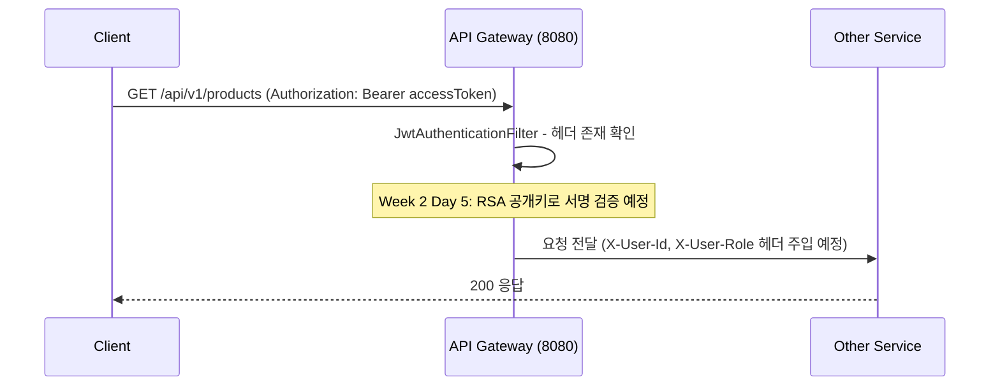

# Auth Service

회원가입, 로그인, JWT 발급·갱신·무효화를 담당하는 인증 서비스.

## 스택

| 항목 | 값 |
|------|-----|
| Framework | Spring Boot 3.5.0 |
| Language | Java 21 |
| DB | PostgreSQL 16 (`auth_db`) |
| Cache | Redis 7.2 |
| JWT | nimbus-jose-jwt 9.40 (RS256) |
| Migration | Flyway |
| Security | Spring Security 6 (STATELESS) |

---

## 로컬 실행

### 사전 조건
- Docker Desktop 실행 중
- `docker/docker-compose.yml`로 PostgreSQL·Redis 기동

```bash
cd docker
docker compose up -d
```

> PostgreSQL: `localhost:5433` (로컬 5432 충돌 방지)  
> Redis: `localhost:6379`

### 서비스 실행

```bash
./gradlew :auth-service:bootRun
```

포트: `8081`

---

## API

| Method | URL | 설명 | Status |
|--------|-----|------|--------|
| POST | `/api/v1/auth/signup` | 회원가입 | 201 |
| POST | `/api/v1/auth/login` | 로그인 (토큰 발급) | 200 |
| POST | `/api/v1/auth/refresh` | Access Token 재발급 | 200 |
| POST | `/api/v1/auth/logout` | 로그아웃 | 204 |

> 상세 요청/응답: [docs/services/auth/api.md](../docs/services/auth/api.md)

### 빠른 테스트

```bash
# 회원가입
curl -s -X POST http://localhost:8080/api/v1/auth/signup \
  -H "Content-Type: application/json" \
  -d '{"email":"test@example.com","password":"password123!","name":"테스터"}' | jq .

# 로그인
curl -s -X POST http://localhost:8080/api/v1/auth/login \
  -H "Content-Type: application/json" \
  -d '{"email":"test@example.com","password":"password123!"}' | jq .

# 토큰 갱신
curl -s -X POST http://localhost:8080/api/v1/auth/refresh \
  -H "Content-Type: application/json" \
  -d '{"refreshToken":"<refresh_token>"}' | jq .

# 로그아웃
curl -s -X POST http://localhost:8080/api/v1/auth/logout \
  -H "Content-Type: application/json" \
  -d '{"refreshToken":"<refresh_token>"}' -w "%{http_code}"
```

> Gateway(8080)를 통해 요청 — Auth Service(8081) 직접 호출 시 Spring Security 필터 통과

---

## 아키텍처

### 로그인 플로우



### 토큰 갱신 플로우 (Rotation)



### 보호된 API 요청 플로우



## JWT 설계

- **알고리즘**: RS256 (RSA 2048bit)
- **키 관리**: 서비스 기동 시 `@PostConstruct`로 인메모리 키페어 생성
- **Access Token**: 1시간, Response Body 반환
- **Refresh Token**: 7일, UUID, Response Body 반환, Redis 저장
- **Rotation**: 갱신 요청마다 기존 Refresh Token 삭제 후 신규 발급

### Redis 키 구조

```
refresh:{refreshToken}  →  "{userId}"  (TTL: 7일)
```

---

## 테스트 실행

```bash
./gradlew :auth-service:test
```

| 테스트 클래스 | 내용 |
|-------------|------|
| `JwtProviderTest` | 토큰 발급, 클레임 검증, 만료 시간 |
| `AuthServiceLoginTest` | 로그인 성공/실패, 예외 케이스 |
| `UserRepositoryTest` | 이메일 조회, 중복 확인 (Testcontainers) |

---

## DB 스키마

Flyway 마이그레이션: `src/main/resources/db/migration/V1__init_schema.sql`

```sql
CREATE TABLE users (
    id           BIGSERIAL PRIMARY KEY,
    email        VARCHAR(255) NOT NULL UNIQUE,
    password     VARCHAR(255) NOT NULL,
    name         VARCHAR(100) NOT NULL,
    role         VARCHAR(20)  NOT NULL DEFAULT 'USER',
    created_at   TIMESTAMP    NOT NULL,
    updated_at   TIMESTAMP    NOT NULL
);
```
